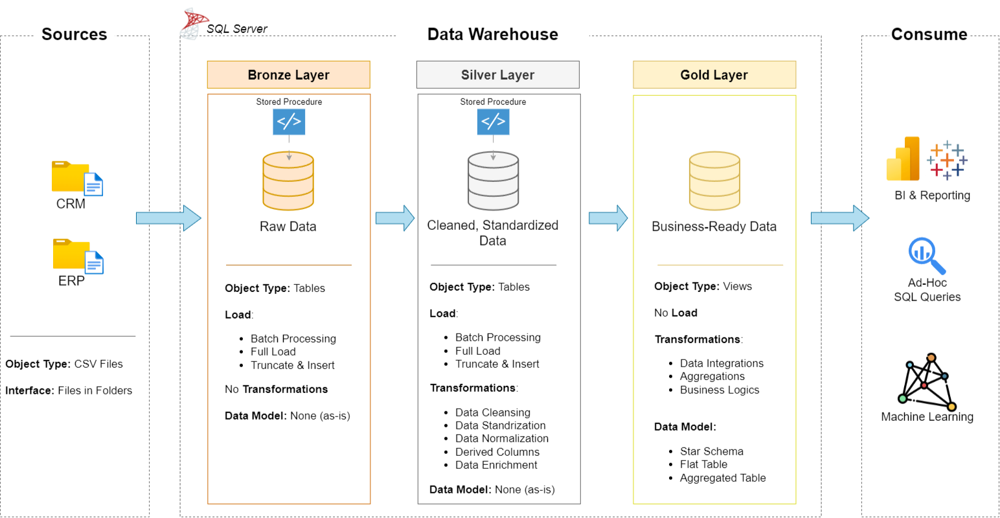

# 🏢 Data Warehouse and Analytics Project

---

## 📌 Overview

Welcome to the **Data Warehouse and Analytics Project** 🚀  
This project demonstrates an **end-to-end modern data warehousing solution**, from raw data ingestion to analytics-ready datasets and business insights.

Designed as a **portfolio-grade project**, it follows **industry best practices** in:
- Data Engineering
- ETL Development
- Dimensional Data Modeling
- SQL-based Analytics & Reporting

This repository is ideal for showcasing skills required for **Data Engineer, Analytics Engineer, BI Developer, and Data Analyst** roles.

---

## 🏗️ Data Architecture (Medallion Architecture)

The project follows the **Medallion Architecture** pattern with **Bronze, Silver, and Gold** layers.

### 🔹 Bronze Layer (Raw Data)
- Stores raw data ingested directly from source systems
- Source format: **CSV files (ERP & CRM)**
- Loaded into **SQL Server**
- No transformations applied

### 🔹 Silver Layer (Cleaned & Standardized)
- Data cleansing and validation
- Standardization and normalization
- Business rule enforcement
- Prepared for analytical modeling

### 🔹 Gold Layer (Analytics-Ready)
- Star schema data models
- Fact and Dimension tables
- Optimized for reporting and BI tools
- Business-friendly and query-efficient

---

## 📖 Project Scope & Features

### ✔️ Data Engineering
- Designed a modern **SQL Server Data Warehouse**
- Built scalable **ETL pipelines**
- Integrated multiple source systems (ERP & CRM)
- Ensured data quality and consistency

### ✔️ Data Modeling
- Implemented **Star Schema**
- Created Fact and Dimension tables
- Optimized models for analytical queries

### ✔️ Analytics & Reporting
- Developed SQL-based analytics
- Generated insights on:
  - Customer behavior
  - Product performance
  - Sales trends

---

## 🛠️ Tools & Resources 

- **Datasets:** CSV files (ERP & CRM) → `datasets/`
- **SQL Server Express**
- **SQL Server Management Studio (SSMS)**
- **Git & GitHub**
- **Draw.io** (Architecture, ETL, Models)
- **Notion** (Project planning & documentation)
---

## 🚀 Project Requirements

### 🔧 Data Engineering Objective
Develop a modern SQL Server data warehouse that consolidates sales data from multiple source systems to support analytics and decision-making.

#### Specifications
- Import data from ERP and CRM CSV files
- Clean and validate data before analysis
- Integrate data into a unified analytical model
- Focus on latest data (no historization)
- Provide clear and structured documentation

---

### 📊 BI & Analytics Objective
Create SQL-based analytical queries to provide insights into:
- Customer behavior
- Product performance
- Sales trends

---

## 📂 Repository Structure
<pre>
data-warehouse-project/
├── datasets/
│   └── Raw source data (ERP & CRM CSV files)
│
├── docs/
│   ├── etl.drawio                 # ETL techniques and transformations
│   ├── data_architecture.drawio   # Overall data warehouse architecture
│   ├── data_catalog.md            # Dataset metadata and field descriptions
│   ├── data_flow.drawio           # End-to-end data flow diagram
│   ├── data_models.drawio         # Star schema and dimensional models
│   └── naming-conventions.md      # Naming standards for tables and columns
│
├── scripts/
│   ├── bronze/                    # Raw data ingestion scripts
│   ├── silver/                    # Data cleansing and transformation scripts
│   └── gold/                      # Analytics-ready data models
│
├── tests/
│   └── Data quality and validation scripts
│
├── README.md                      # Project overview and setup instructions
├── LICENSE                        # License information
</pre>
🚀 About Me
---
👋 Hi, I’m Anmol Singh. I’m a Data Engineering & Analytics enthusiast with strong hands-on experience in SQL, Data Warehousing, ETL pipelines, and analytical reporting.
I build scalable data solutions that transform raw data into business-ready insights.
